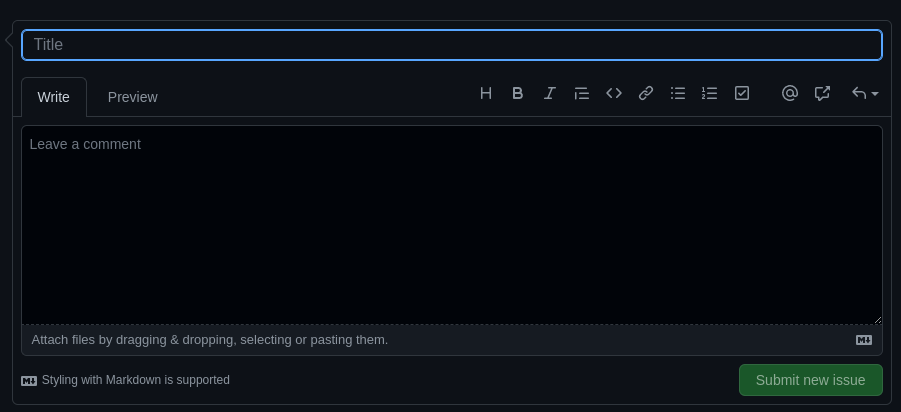

# Olá  Bem vindo ao repositório do projeto **All For One**🤺!

### Esse foi o meu primeiro contato com os comandos do MySQL. Fizemos esse projeto na trybe com o intuito de praticar todos os comando básicos do SQL, Utilizando o banco de dados `Northwind`.

---

## **Orientações:**

### **Tecnologias utilizada:**

> MySQL
> 

  
<strong>Como clonar os arquivos 📝</strong>

  
<h3>
  Para que essa aplicação funcione na sua máquina, será necessário seguir os seguintes passos:
  
  * 1 - Abra o CMD/terminal de comando do seu sistema através da pesquisa e faça os seguintes passo:
  
    - Se você utiliza `linux` ou `mac` em português, digite `cd Área\ de\ Trabalho` e em seguida `mkdir project-all-for-one` para que seja criada a pasta onde você fará o clone do projeto. Essa pasta será criada na tela inicial;
    - Caso utilize o `windows` ou o linux e mac em inglês, digite `cd desktop` e em seguida `mkdir project-all-for-one` para que seja criada a pasta onde você fará o clone do projeto. Essa pasta assim como da outra forma, será criada na tela inicial;
  
  * 2 - Em seguida utilize o comando `cd project-all-for-one` para entrar na pasta criada
  
  * 3 - Dentro da pasta, no terminal, utilize o comando `git clone git@github.com:PedrHenrick/Project-All-For-One.git` para clonar a pasta do repositório
  
  * 4 - Logo depois entre na pasta clonada utilizando o comando `cd Project-All-For-One`
  
  E pronto! Já temos nossa aplicação na sua máquina. Agora você já pode fechar o terminal e abrir a pasta que está na área de trabalho e em seguida a pasta com o nome do projeto, lá você verá arquivos com o nome `desafioX.sql` onde `X` é o número dos exercícios listados no tópico <a href="#desafios">desafios</a>.
  </h3>
   

  
<strong>O que fazer quando encontrar erros 🚫</strong>

  <h3>
    Caso encontre algum erro referente a sintaxe ou funcionamento do mesmo, abra uma `Issue`
  </h3>
  
  * <h3>1 - Para iniciarmos, clique em <strong>issues</strong> como na foto abaixo:</h3>
  
    
  
  * <h3>2 - Após isso, clique em <strong>new issue:</strong></h3>
  
    
  
  * <h3>3 - Agora adicione um título sobre problema encontrado, adicione uma descrição mostrando como ocorreu o erro e por fim clique no botão <strong>submit new issue</strong>:</h3>
  
    
  
  * <h3>E pronto, o problema já foi documentado e será resolvido o mais rápido possível.</h3>
  
    
  
  <h3>Temos também a opção de utilizar o <a href="#form">formulário de feedback</a> encontrado no fim desse arquivo!!</h3>
   

  
<strong>O que fazer após o code-review ✅</strong>

  <h3>
    Após o seu review sobre tudo o que foi abordado, deixo como sugestão responder este <a href="https://forms.gle/ZJjEZNEAuc9QUauY9" target="_blank">formulário de feedback</a>, desenvolvido por mim para auxiliar na melhoria desse e de outros projetos.
  </h3>
  <h3>
    Aguardo sua resposta, obrigado!
  </h3>

---

## **Desafios:**

### **Desafios Iniciais:**

  * 1 - Exiba apenas os nomes dos produtos na tabela `products`.

  * 2 - Exiba os dados de todas as colunas da tabela `products`.

  * 3 - Escreva uma query que exiba os valores da coluna que representa a primary key da tabela `products`.

  * 4 - Conte quantos registros existem na coluna `product_name` da tabela `products`.

  * 5 - Monte uma query que exiba os dados da tabela `products` a partir do quarto registro até o décimo terceiro.

  * 6 - Exiba os dados das colunas `product_name` e `id` da tabela `products` de maneira que os resultados estejam em ordem alfabética dos nomes.

  * 7 - Mostre apenas os ids dos 5 últimos registros da tabela `products` (a ordernação deve ser baseada na coluna `id`).

  * 8 - Faça uma consulta que retorne três colunas, respectivamente, com os nomes 'A', 'Trybe' e 'eh', e com valores referentes a soma de '5 + 6', a string 'de', a soma de '2 + 8'.
---
### **Desafios sobre filtragem de dados:**

  * 9 - Mostre todos os valores de `notes` da tabela `purchase_orders` que não são nulos.

  * 10 - Mostre todos os dados da tabela `purchase_orders` em ordem decrescente, ordenados por `created_by` em que o `created_by` é maior ou igual a 3.

  * 11 - Exiba os dados da coluna `notes` da tabela `purchase_orders` em que seu valor de `Purchase generated based on Order` é maior ou igual a 30 e menor ou igual a 39.

  * 12 - Mostre as `submitted_date` de `purchase_orders` em que a `submitted_date` é do dia 26 de abril de 2006.

  * 13 - Mostre o `supplier_id` das `purchase_orders` em que o `supplier_id` seja 1 ou 3.

  * 14 - Mostre os resultados da coluna `supplier_id` da tabela `purchase_orders` em que o `supplier_id` seja maior ou igual a 1 e menor ou igual 3.

  * 15 - Mostre somente as horas (sem os minutos e os segundos) da coluna `submitted_date` de todos registros da tabela `purchase_orders`.

  * 16 - Exiba a `submitted_date` das `purchase_orders` que estão entre `2006-01-26 00:00:00` e `2006-03-31 23:59:59`.

  * 17 - Mostre os registros das colunas `id` e `supplier_id` das `purchase_orders` em que os `supplier_id` sejam tanto 1, ou 3, ou 5, ou 7.

  * 18 - Mostre todos os registros de `purchase_orders` que tem o `supplier_id` igual a 3 e `status_id` igual a 2.

  * 19 - Mostre a quantidade de pedidos que foram feitos na tabela `orders` pelo `employee_id` igual a 5 ou 6, e que foram enviados através do método(coluna) `shipper_id` igual a 2.
---
### **Desafios de manipulação de tabelas:**

  * 20 - Adicione à tabela `order_details` um registro com `order_id`: 69, `product_id`: 80, `quantity`: 15.0000, `unit_price`: 15.0000, `discount`: 0, `status_id`: 2, `date_allocated`: NULL, `purchase_order_id`: NULL e `inventory_id`: 129.

  * 21 - Adicione com um único `INSERT`, duas linhas à tabela `order_details` com os mesmos dados do requisito 20.

  * 22 - Atualize os dados de `discount` do `order_details` para 15. (Não é necessário utilizar o SAFE UPDATE em sua query).

  * 23 - Atualize os dados da coluna `discount` da tabela `order_details` para 30, onde o valor na coluna `unit_price` seja menor que 10.0000.

  * 24 - Atualize os dados da coluna `discount` da tabela `order_details` para 45, onde o valor na coluna `unit_price` seja maior que 10.0000 e o id seja um número entre 30 e 40.

  * 25 - Delete todos os dados em que a `unit_price` da tabela `order_details` seja menor que 10.0000.

  * 26 - Delete todos os dados em que a `unit_price` da tabela `order_details` seja maior que 10.0000.

  * 27 - Delete todos os dados da tabela `order_details`.
---
